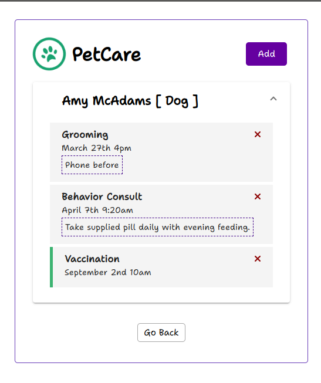
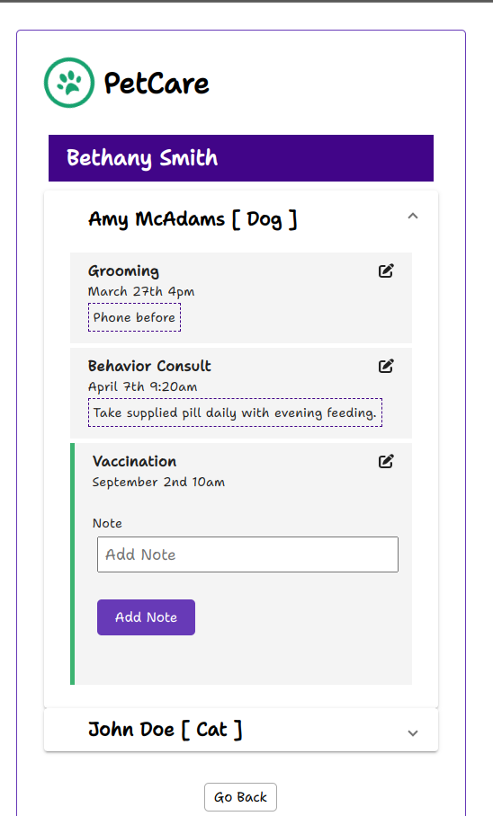
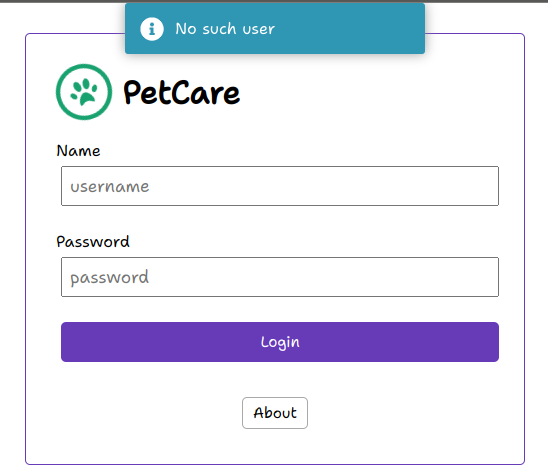
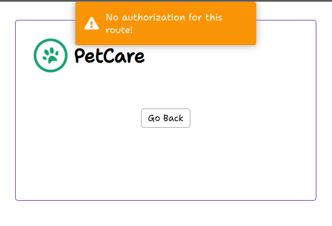

# PetCare

This project was generated with [Angular CLI](https://github.com/angular/angular-cli) version 15.1.6.
Built on a TODO app tutorial by Traversy Media, this is a project that models a veterinary appointment manager.
Backend is provided by json-server: https://www.npmjs.com/package/json-server.

This is a small project intended to give me an overview of Angular.

## Start

Clone the repository and run `npm install`.

## Development server

Run `ng serve` for a dev server. Navigate to `http://localhost:4200/`. The application will automatically reload if you change any of the source files.

## Run json-server

Run `json-server --watch db.json --port 5000`.
Starter data is provided in the db.json file.

## Build

Run `ng build` to build the project. The build artifacts will be stored in the `dist/` directory.

## Use

Log in with one of the existing users (any password will work)
You can add and remove appointments.

Or log in with a doctor's account using the password 'admin' and view or comment on existing appointments.

The username is validated.

When trying to directly access the admin route without authorization the application prevents it.

